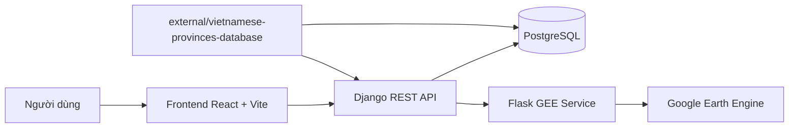

# Web GIS Climate Analysis Platform

Hệ thống WebGIS phân tích khí hậu và hạn hán, cho phép theo dõi lượng mưa, nhiệt độ, độ ẩm đất, NDVI và TVDI theo địa điểm hành chính hoặc vùng hình học tùy chọn. Dự án hiện tại chạy trên kiến trúc Django REST Framework + React/Vite + PostgreSQL, kết hợp một Flask service riêng để giao tiếp với Google Earth Engine.

## Mục lục

- [1. Giới thiệu dự án](#1-giới-thiệu-dự-án)
- [2. Demo](#2-demo)
- [3. Kiến trúc hệ thống](#3-kiến-trúc-hệ-thống)
- [4. Công nghệ sử dụng](#4-công-nghệ-sử-dụng)
- [5. Cấu trúc thư mục](#5-cấu-trúc-thư-mục)
- [6. Hướng dẫn cài đặt](#6-hướng-dẫn-cài-đặt)
- [7. Hướng dẫn sử dụng](#7-hướng-dẫn-sử-dụng)
- [8. Luồng xử lý chính](#8-luồng-xử-lý-chính)
- [9. Định dạng dữ liệu đầu vào và đầu ra](#9-định-dạng-dữ-liệu-đầu-vào-và-đầu-ra)
- [10. Đóng góp và phát triển thêm](#10-đóng-góp-và-phát-triển-thêm)
- [Thông tin chưa xác định từ source code](#thông-tin-chưa-xác-định-từ-source-code)

## 1. Giới thiệu dự án

### Dự án làm gì

Đây là một ứng dụng WebGIS phục vụ phân tích biến động thời tiết và hiện trạng thảm thực vật. Hệ thống hỗ trợ:

- Phân tích lượng mưa theo ngày, tháng, năm và so sánh giữa 2 giai đoạn hoặc 2 địa điểm.
- Phân tích nhiệt độ theo ngày và theo tháng.
- Phân tích độ ẩm đất theo ngày và theo tháng.
- Phân tích NDVI theo ngày, tháng, năm.
- Phân tích TVDI, tổng hợp hạn hán và liệt kê các đợt hạn nghiêm trọng.
- Chọn vùng phân tích bằng địa điểm có sẵn, click trên bản đồ, vẽ polygon tay hoặc upload GeoJSON.
- Phân tích trực tiếp từ Google Earth Engine hoặc đồng bộ dữ liệu về PostgreSQL để tái sử dụng.

### Bài toán dự án giải quyết

Từ source code hiện tại có thể xác định hệ thống hướng tới các bài toán:

- Theo dõi điều kiện khí hậu theo thời gian tại một địa điểm cụ thể.
- Đánh giá hiện trạng thảm thực vật và mức độ khô hạn qua NDVI, TVDI.
- Khai thác dữ liệu viễn thám và khí tượng từ Google Earth Engine nhưng vẫn có khả năng lưu cục bộ vào cơ sở dữ liệu để dùng lại.
- Xây dựng giao diện WebGIS cho phép người dùng không chuyên kỹ thuật vẫn chọn vùng phân tích linh hoạt.

### Use case thực tế

- Giám sát lượng mưa, nhiệt độ và độ ẩm đất theo từng tỉnh/thành hoặc vùng tự chọn.
- Theo dõi sức khỏe thảm thực vật bằng NDVI.
- Theo dõi nguy cơ hạn bằng TVDI.
- So sánh khác biệt khí hậu giữa hai giai đoạn thời gian hoặc hai vị trí.
- Lưu lại các vùng phân tích gần đây theo từng tài khoản để tái sử dụng.

## 2. Demo

### URL demo

Chưa xác định từ source code.

### Luồng hoạt động có thể suy ra từ source

1. Người dùng đăng ký hoặc đăng nhập để lấy JWT token.
2. Người dùng chọn địa điểm trong dropdown hoặc vào trang bản đồ để:
   - chọn tỉnh/phường-xã theo ranh giới hành chính,
   - click khu vực trên bản đồ,
   - vẽ polygon tay,
   - hoặc upload GeoJSON.
3. Với các module mưa, nhiệt độ, NDVI, TVDI, người dùng có thể:
   - bấm `Phân tích` để lấy dữ liệu trực tiếp từ Google Earth Engine,
   - hoặc bấm `Tải từ GEE` để đồng bộ dữ liệu về PostgreSQL.
4. Người dùng xem biểu đồ, thống kê, dashboard tổng quan, lịch sử thao tác và các vùng phân tích gần đây.

## 3. Kiến trúc hệ thống

### Sơ đồ tổng thể



### Vai trò từng thành phần

| Thành phần | Vai trò |
| --- | --- |
| Frontend React/Vite | Giao diện đăng nhập, dashboard, bản đồ, biểu đồ và form phân tích |
| Django REST Framework | API chính của hệ thống, xử lý auth, activity log, thống kê, đọc/ghi PostgreSQL, điều phối GEE |
| Flask GEE service | Service Python riêng để khởi tạo Earth Engine, truy vấn collection, tính toán và đồng bộ dữ liệu |
| PostgreSQL | Lưu tài khoản, log hoạt động, địa điểm, dữ liệu khí hậu, lịch sử vùng phân tích, ranh giới hành chính |
| `external/vietnamese-provinces-database` | Nguồn chuẩn hóa tên/mã hành chính và dữ liệu hành chính mới để bootstrap bảng chuẩn |
| `legacy/node-express/` | Phiên bản cũ dùng Express + static HTML, chỉ giữ lại để tham chiếu |

### Pipeline phân tích tổng quát

```text
Frontend
  -> Django API
    -> (1) đọc DB nếu source=db
    -> (2) gọi Flask GEE service nếu source=gee hoặc đồng bộ GEE
      -> Google Earth Engine
      -> tính toán thống kê theo vùng/thời gian
      -> trả dữ liệu về Django
    -> Django trả JSON cho frontend
  -> Frontend hiển thị biểu đồ, thống kê, trạng thái và bản đồ
```

### Điểm vào chính của hệ thống

| Loại | File |
| --- | --- |
| Django backend entry point | `backend/manage.py` |
| Django URL root | `backend/config/urls.py` |
| Django settings | `backend/config/settings.py` |
| Flask GEE service entry point | `backend/scripts/api_server.py` |
| React frontend entry point | `frontend/src/main.jsx` |
| React router | `frontend/src/App.jsx` |

## 4. Công nghệ sử dụng

### Tech stack chính

| Nhóm | Công nghệ | Vai trò |
| --- | --- | --- |
| Backend | Django 5.1.5 | API chính |
| Backend | Django REST Framework 3.15.2 | Xây dựng REST API |
| Backend | django-cors-headers | CORS cho frontend |
| Backend | PyJWT, bcrypt | JWT auth và băm mật khẩu |
| Backend | requests | Gọi Flask GEE service |
| Backend | Flask 3.1, Flask-Cors | Service riêng để làm việc với GEE |
| Backend | pandas | Xử lý bảng dữ liệu trong service GEE |
| Backend | shapely | Tính centroid, chuẩn hóa geometry, xử lý vùng phân tích |
| Frontend | React 18 | UI |
| Frontend | Vite 6 | Dev server và build |
| Frontend | React Router DOM | Routing SPA |
| Frontend | Axios | HTTP client |
| Frontend | Chart.js, react-chartjs-2 | Biểu đồ |
| Frontend | Leaflet, react-leaflet | WebGIS và tương tác bản đồ |
| Database | PostgreSQL | Lưu dữ liệu hệ thống |
| Dữ liệu ngoài | Google Earth Engine | Truy xuất dữ liệu viễn thám/khí hậu |
| Dữ liệu ngoài | `thanglequoc/vietnamese-provinces-database` | Chuẩn hành chính mới và bootstrap dữ liệu hành chính |

### Google Earth Engine
 Hệ thống hiện sử dụng:

- Google Earth Engine để truy vấn và xử lý dữ liệu viễn thám/khí tượng.
- Các công thức và thống kê viễn thám để tính chỉ số, không phải pipeline ML học máy.

### Nguồn dữ liệu viễn thám và khí tượng đang dùng

| Chỉ số | Nguồn trong code | Ghi chú |
| --- | --- | --- |
| Lượng mưa | `UCSB-CHG/CHIRPS/DAILY` | Lấy band `precipitation`, tính trung bình theo vùng |
| Nhiệt độ | `ECMWF/ERA5_LAND/DAILY_AGGR` | Dùng `temperature_2m`, `temperature_2m_min`, `temperature_2m_max`, chuyển K sang độ C |
| Độ ẩm đất | `ECMWF/ERA5_LAND/DAILY_AGGR` | Dùng các layer đất 1/2/3 |
| NDVI | `MODIS/061/MOD13Q1` | Dùng band `NDVI`, scale `0.0001` |
| TVDI | `MOD11A2` + `MOD13Q1` | Tính từ quan hệ LST-NDVI, có fallback về chuẩn hóa LST nếu không fit được wet/dry edge |

### Công thức có thể suy ra trực tiếp từ source

- Nhiệt độ: `temp_c = temp_k - 273.15`
- NDVI trong code hiện tại lấy từ sản phẩm MODIS NDVI đã được tính sẵn, sau đó nhân scale `0.0001`
- TVDI trong code hiện tại:
  - ưu tiên fit `wet edge` và `dry edge` theo LST-NDVI,
  - sau đó tính `TVDI = (LST - wetEdge) / (dryEdge - wetEdge)`,
  - nếu không đủ mẫu thì fallback về chuẩn hóa theo miền giá trị LST trong vùng

## 5. Cấu trúc thư mục

```text
backend/
  apps/
    accounts/            API đăng ký, đăng nhập, người dùng hiện tại
    activity/            Ghi log và thống kê hoạt động
    climate/             API khí hậu, dashboard, boundaries, history vùng phân tích
    common/              Auth JWT, helper, chuẩn response
    gee/                 Proxy từ Django sang Flask GEE service
  config/                settings.py, urls.py, asgi.py, wsgi.py
  scripts/               Service GEE, bootstrap dữ liệu hành chính, import boundary
  sql/                   SQL tạo schema chính, history vùng, admin boundaries
  manage.py              Entry point Django
  requirements.txt

frontend/
  src/
    api/                 Axios client
    components/          Layout, biểu đồ, modal đồng bộ
    context/             AuthContext
    pages/               Dashboard, bản đồ, khí hậu, activity, auth
    styles/              CSS chính
    utils/               Helper cho map, scope geometry, tiếng Việt, aggregate
  package.json
  vite.config.js

legacy/
  node-express/          Phiên bản cũ dùng Express + static HTML

external/
  vietnamese-provinces-database/
                        Dataset ngoài, không phải thành phần runtime bắt buộc
```

### Giải thích các thư mục quan trọng

| Thư mục | Mục đích |
| --- | --- |
| `backend/apps/climate` | Module lõi của nghiệp vụ khí hậu, boundaries, dashboard |
| `backend/apps/gee` | Proxy và validate payload cho các tác vụ GEE |
| `backend/scripts/api_server.py` | Service Flask giao tiếp trực tiếp với Earth Engine |
| `backend/scripts/bootstrap_thanglequoc_admin_data.py` | Nạp dữ liệu hành chính chuẩn và dựng geometry/centroid vào DB |
| `frontend/src/pages/MapPage.jsx` | Trang WebGIS, hỗ trợ click boundary, vẽ polygon, upload GeoJSON |
| `frontend/src/pages/*Page.jsx` | Mỗi trang là một module nghiệp vụ riêng |
| `legacy/node-express` | Dùng để tham chiếu logic cũ, không phải kiến trúc đang chạy |

## 6. Hướng dẫn cài đặt

### 6.1. Yêu cầu môi trường

Từ source code có thể xác định dự án cần:

- Python 3.x
- Node.js + npm
- PostgreSQL
- Một Google Cloud project đã đăng ký dùng Google Earth Engine
- Quyền truy cập Earth Engine bằng OAuth người dùng hoặc service account

Phiên bản Python/Node tối thiểu chính xác chưa được khóa rõ trong source code.

### 6.2. Cài dependencies

Tại thư mục gốc repository:

```powershell
python -m venv .venv
.\.venv\Scripts\Activate.ps1
pip install -r .\backend\requirements.txt

cd .\frontend
npm install
cd ..
```

### 6.3. Tạo file cấu hình

#### Backend

```powershell
Copy-Item .\backend\.env.example .\backend\.env
```

Các biến quan trọng trong `backend/.env`:

| Biến | Bắt buộc | Ý nghĩa |
| --- | --- | --- |
| `DEBUG` | Có | Bật/tắt debug Django |
| `ALLOWED_HOSTS` | Có | Host cho Django |
| `DJANGO_SECRET_KEY` | Có | Secret key Django |
| `JWT_SECRET` | Có | Secret ký JWT |
| `JWT_EXPIRES_DAYS` | Không | Số ngày hết hạn token |
| `DB_HOST` | Có | Host PostgreSQL |
| `DB_PORT` | Có | Port PostgreSQL |
| `DB_USER` | Có | User PostgreSQL |
| `DB_PASS` | Có | Password PostgreSQL |
| `DB_NAME` | Có | Tên database |
| `PYTHON_GEE_API_URL` | Có | URL Flask GEE service, mặc định `http://127.0.0.1:3001` |
| `GEE_PROJECT` | Có khi dùng GEE thật | Google Cloud project cho Earth Engine |
| `GEE_SERVICE_ACCOUNT` | Không | Email service account nếu không dùng OAuth local |
| `GEE_PRIVATE_KEY_FILE` | Không | Đường dẫn file JSON key của service account |
| `FLASK_DEBUG` | Không | Debug cho Flask service |
| `GEE_API_PORT` | Không | Port của Flask service |
| `CORS_ALLOW_ALL` | Không | Cho phép tất cả origin |
| `CORS_ALLOWED_ORIGINS` | Không | Danh sách origin được phép |

#### Frontend

```powershell
Copy-Item .\frontend\.env.example .\frontend\.env
```

Nội dung mẫu:

```env
VITE_API_BASE_URL=http://localhost:8000/api
```

Nếu backend chạy ở cổng khác, cập nhật lại biến này cho phù hợp.

### 6.4. Khởi tạo cơ sở dữ liệu

#### Bước 1: tạo database

Ví dụ với PostgreSQL:

```sql
CREATE DATABASE web_gis;
```

#### Bước 2: tạo các bảng nghiệp vụ chính

```powershell
psql -U postgres -d web_gis -f .\backend\sql\bootstrap_schema.sql
psql -U postgres -d web_gis -f .\backend\sql\bootstrap_analysis_area_history.sql
psql -U postgres -d web_gis -f .\backend\sql\bootstrap_admin_boundaries.sql
```

`bootstrap_schema.sql` tạo các bảng nghiệp vụ như `users`, `locations`, `rainfall_data`, `temperature_data`, `soil_moisture_data`, `ndvi_data`, `tvdi_data` và seed một địa điểm mặc định.

#### Bước 3: tạo các bảng hệ thống Django

```powershell
cd .\backend
python manage.py migrate
cd ..
```

Lưu ý:

- Các model nghiệp vụ chính trong `apps/*/models.py` đang là `managed = False`.
- Vì vậy, schema nghiệp vụ không được sinh bằng Django migration mà phải bootstrap bằng SQL/script riêng.

#### Bước 4: nạp dữ liệu hành chính chuẩn từ repo ngoài

Nếu bạn đã clone repo `thanglequoc/vietnamese-provinces-database` vào `external/vietnamese-provinces-database`, chạy:

```powershell
python .\backend\scripts\bootstrap_thanglequoc_admin_data.py --dataset-root ".\external\vietnamese-provinces-database"
```

Script này sẽ:

- nạp các bảng chuẩn hành chính như `administrative_regions`, `administrative_units`, `provinces`, `wards`
- dựng geometry/centroid và ghi vào `admin_boundaries`
- đồng bộ cấp tỉnh vào bảng `locations`

### 6.5. Kết nối Google Earth Engine

Để chạy phân tích thật với GEE, source code hiện tại yêu cầu:

1. Khai báo `GEE_PROJECT` trong `backend/.env`
2. Xác thực Earth Engine:

```powershell
python -c "import ee; ee.Authenticate()"
```

Hoặc dùng service account nếu đã cấu hình `GEE_SERVICE_ACCOUNT` và `GEE_PRIVATE_KEY_FILE`.

3. Chạy Flask GEE service:

```powershell
python -X utf8 .\backend\scripts\api_server.py
```

4. Kiểm tra trạng thái:

```powershell
Invoke-RestMethod http://127.0.0.1:3001/status
```

Kết quả mong đợi:

```json
{
  "status": "online",
  "gee_initialized": true
}
```

### 6.6. Chạy project

Mô hình runtime hiện tại cần 3 tiến trình riêng.

#### Terminal 1: Flask GEE service

```powershell
cd D:\path\to\repo
.\.venv\Scripts\Activate.ps1
python -X utf8 .\backend\scripts\api_server.py
```

#### Terminal 2: Django backend

```powershell
cd D:\path\to\repo
.\.venv\Scripts\Activate.ps1
cd .\backend
python manage.py runserver 0.0.0.0:8000
```

#### Terminal 3: Frontend React/Vite

```powershell
cd D:\path\to\repo\frontend
npm run dev
```

#### Địa chỉ mặc định

- Frontend: `http://localhost:5173`
- Django API: `http://127.0.0.1:8000/api`
- Flask GEE service: `http://127.0.0.1:3001`

## 7. Hướng dẫn sử dụng

### 7.1. Cơ chế xác thực

- `POST /api/auth/register` và `POST /api/auth/login` là public
- `POST /api/auth/logout`, `GET /api/auth/me`, toàn bộ `activity`, `analysis-areas/history` cần JWT
- Nhiều endpoint khí hậu, boundaries, locations, GEE status/fetch đã được mở `permission_classes = []` trong source code

Header xác thực:

```http
Authorization: Bearer <jwt-token>
```

### 7.2. Nhóm endpoint chính

#### Auth

| Method | Endpoint | Mục đích |
| --- | --- | --- |
| `POST` | `/api/auth/register` | Đăng ký tài khoản |
| `POST` | `/api/auth/login` | Đăng nhập |
| `POST` | `/api/auth/logout` | Đăng xuất |
| `GET` | `/api/auth/me` | Lấy thông tin user hiện tại |

#### Activity

| Method | Endpoint | Mục đích |
| --- | --- | --- |
| `POST` | `/api/activity/log` | Ghi log thao tác |
| `GET` | `/api/activity/history` | Lấy lịch sử hoạt động của user |
| `GET` | `/api/activity/stats` | Thống kê hoạt động theo khoảng thời gian |

#### Dữ liệu nền và WebGIS

| Method | Endpoint | Mục đích |
| --- | --- | --- |
| `GET` | `/api/` | Healthcheck và danh sách nhóm endpoint |
| `GET` | `/api/locations` | Danh sách địa điểm |
| `GET` | `/api/locations/{id}` | Chi tiết địa điểm |
| `GET` | `/api/boundaries` | Danh sách ranh giới hành chính |
| `GET` | `/api/boundaries/{admin_level}/{boundary_code}` | Chi tiết một boundary |
| `GET` | `/api/standard/provinces` | Danh sách tỉnh/thành từ dataset chuẩn |
| `GET` | `/api/standard/wards` | Danh sách ward/phường-xã từ dataset chuẩn |
| `GET` | `/api/analysis-areas/history` | Lịch sử vùng phân tích gần đây của user |
| `POST` | `/api/analysis-areas/history` | Lưu một vùng phân tích vào lịch sử |

#### Phân tích khí hậu

| Method | Endpoint | Mục đích |
| --- | --- | --- |
| `GET`, `POST` | `/api/rainfall` | Phân tích lượng mưa theo khoảng thời gian |
| `GET` | `/api/rainfall/monthly` | Tổng hợp mưa theo tháng |
| `GET` | `/api/rainfall/yearly` | Tổng hợp mưa theo năm |
| `GET` | `/api/rainfall/compare-periods` | So sánh 2 giai đoạn |
| `GET` | `/api/rainfall/compare-locations` | So sánh 2 địa điểm |
| `GET`, `POST` | `/api/temperature` | Phân tích nhiệt độ |
| `GET` | `/api/temperature/monthly` | Tổng hợp nhiệt độ theo tháng |
| `GET` | `/api/soil-moisture` | Phân tích độ ẩm đất theo địa điểm |
| `GET` | `/api/soil-moisture/monthly` | Tổng hợp độ ẩm đất theo tháng |
| `GET`, `POST` | `/api/ndvi` | Phân tích NDVI |
| `GET` | `/api/ndvi/monthly` | Tổng hợp NDVI theo tháng |
| `GET` | `/api/ndvi/yearly` | Tổng hợp NDVI theo năm |
| `GET`, `POST` | `/api/tvdi` | Phân tích TVDI |
| `GET` | `/api/tvdi/monthly` | Tổng hợp TVDI theo tháng |
| `GET` | `/api/tvdi/drought-summary` | Tổng hợp hạn hán theo năm |
| `GET` | `/api/tvdi/severe-events` | Liệt kê đợt hạn nghiêm trọng |
| `GET` | `/api/dashboard/overview` | Dashboard tổng quan |
| `GET` | `/api/dashboard/timeseries` | Chuỗi thời gian đa chỉ số |

#### GEE proxy và đồng bộ

| Method | Endpoint | Mục đích |
| --- | --- | --- |
| `GET` | `/api/gee/status` | Kiểm tra Flask GEE service |
| `POST` | `/api/gee/fetch` | Đồng bộ một hoặc nhiều loại dữ liệu từ GEE về DB |
| `POST` | `/api/gee/fetch-rainfall` | Đồng bộ riêng lượng mưa |
| `POST` | `/api/gee/fetch-temperature` | Đồng bộ riêng nhiệt độ |
| `POST` | `/api/gee/fetch-all` | Đồng bộ tất cả nhóm dữ liệu |

### 7.3. Ví dụ gọi API

#### Đăng nhập

```http
POST /api/auth/login
Content-Type: application/json
```

```json
{
  "username": "demo",
  "password": "123456"
}
```

Ví dụ response:

```json
{
  "success": true,
  "data": {
    "message": "Login successful",
    "token": "<jwt-token>",
    "user": {
      "id": 1,
      "username": "demo",
      "email": "demo@example.com",
      "fullName": "Demo User",
      "role": "user"
    }
  }
}
```

#### Lấy dữ liệu lượng mưa theo location từ DB

```http
GET /api/rainfall?location_id=1&start=2020-01-01&end=2020-12-31&source=db
```

Ví dụ response:

```json
{
  "success": true,
  "data": {
    "data": [
      {
        "date": "2020-01-01",
        "rainfall_mm": 12.3,
        "source": "chirps"
      }
    ],
    "statistics": {
      "total": 12.3,
      "average": 12.3,
      "max": 12.3,
      "days": 1
    }
  }
}
```

#### Phân tích lượng mưa theo geometry tùy chọn

```http
POST /api/rainfall
Authorization: Bearer <jwt-token>
Content-Type: application/json
```

```json
{
  "area_name": "Vung thu nghiem",
  "province": "Quang Tri",
  "source_type": "draw_polygon",
  "start_date": "2020-01-01",
  "end_date": "2020-01-31",
  "geometry": {
    "type": "Feature",
    "properties": {},
    "geometry": {
      "type": "Polygon",
      "coordinates": [
        [
          [107.05, 16.72],
          [107.19, 16.72],
          [107.19, 16.84],
          [107.05, 16.84],
          [107.05, 16.72]
        ]
      ]
    }
  }
}
```

Ví dụ response:

```json
{
  "success": true,
  "data": {
    "data": [
      {
        "date": "2020-01-01",
        "rainfall_mm": 5.8,
        "source": "chirps"
      }
    ],
    "statistics": {
      "total": 5.8,
      "average": 5.8,
      "max": 5.8,
      "days": 1
    },
    "analysis_scope": {
      "mode": "geometry",
      "area_name": "Vung thu nghiem",
      "province": "Quang Tri",
      "history_id": 12
    }
  }
}
```

#### Đồng bộ dữ liệu từ GEE về DB

```http
POST /api/gee/fetch
Content-Type: application/json
```

```json
{
  "province": "Quang Tri",
  "location_id": 1,
  "start_date": "2020-01-01",
  "end_date": "2020-01-31",
  "data_types": ["rainfall", "temperature"]
}
```

Ví dụ response:

```json
{
  "success": true,
  "data": {
    "success": true,
    "message": "Data fetched and saved successfully",
    "province": "Quang Tri",
    "location_id": 1,
    "history_id": null,
    "period": "2020-01-01 to 2020-01-31",
    "results": {
      "rainfall": {
        "records": 31,
        "attempted": 31,
        "saved": 31,
        "failed": 0,
        "errors": []
      },
      "temperature": {
        "records": 31,
        "attempted": 31,
        "saved": 31,
        "failed": 0,
        "errors": []
      }
    }
  }
}
```

### 7.4. Quy tắc payload GEE sync

Từ `backend/apps/gee/services.py`, payload cho `/api/gee/fetch` phải tuân theo:

- Bắt buộc có `start_date`, `end_date`
- Bắt buộc có một trong hai:
  - `province` cho phân tích theo location
  - `geometry` cho phân tích theo vùng tùy chọn
- `geometry` phải là một trong các loại:
  - `Feature`
  - `FeatureCollection`
  - `Polygon`
  - `MultiPolygon`
- `data_types` phải là mảng không rỗng, và chỉ được chứa:
  - `rainfall`
  - `temperature`
  - `soil_moisture`
  - `ndvi`
  - `tvdi`

## 8. Luồng xử lý chính

### 8.1. Phân tích theo location từ DB

```text
Dropdown địa điểm
  -> Frontend gọi GET /api/<module>?location_id=...&source=db
  -> Django đọc bảng PostgreSQL tương ứng
  -> Tính thống kê và trả JSON
  -> Frontend dựng biểu đồ và thẻ thống kê
```

Áp dụng cho:

- rainfall
- temperature
- soil-moisture
- ndvi
- tvdi
- dashboard

### 8.2. Phân tích trực tiếp từ GEE theo location

```text
Dropdown địa điểm + khoảng ngày
  -> Frontend gọi GET /api/<module>?source=gee
  -> Django kiểm tra trạng thái Flask GEE service
  -> Django gọi Flask /fetch-data với persist=false, include_data=true
  -> Flask truy vấn Earth Engine
  -> Flask trả dữ liệu thô
  -> Django tổng hợp statistics
  -> Frontend hiển thị kết quả
```

Lưu ý:

- Luồng này không lưu DB nếu `persist=false`
- `soil-moisture` đang hỗ trợ live GEE theo location bằng `GET`, nhưng chưa thấy route `POST` geometry riêng trong source code như 4 module ưu tiên còn lại

### 8.3. Phân tích trực tiếp từ GEE theo geometry

Áp dụng cho:

- `POST /api/rainfall`
- `POST /api/temperature`
- `POST /api/ndvi`
- `POST /api/tvdi`

Luồng:

```text
Bản đồ / polygon tay / GeoJSON upload
  -> Frontend gửi GeoJSON lên Django
  -> Django chuẩn hóa geometry, kiểm tra payload
  -> Django gọi Flask GEE service với persist=false
  -> Flask dựng ee.Geometry từ GeoJSON
  -> Earth Engine tính dữ liệu theo vùng
  -> Django lưu lịch sử vùng phân tích nếu user đăng nhập
  -> Frontend hiển thị kết quả và aggregate theo tháng khi cần
```

### 8.4. Đồng bộ GEE về DB

```text
Người dùng bấm "Tải từ GEE"
  -> Frontend gọi POST /api/gee/fetch
  -> Django validate payload và proxy sang Flask
  -> Flask truy vấn GEE
  -> Flask upsert dữ liệu vào bảng PostgreSQL tương ứng
  -> Django trả số bản ghi đã đồng bộ
  -> Frontend reload lại dữ liệu từ DB
```

Trong luồng geometry sync, source code hiện tại còn hỗ trợ:

- tạo location tùy chỉnh nếu cần
- lưu lại `analysis_area_history` gắn với tài khoản

### 8.5. Luồng bản đồ và ranh giới hành chính

```text
MapPage
  -> GET /api/boundaries (ưu tiên admin_boundaries có geometry)
  -> fallback sang /api/locations nếu thiếu boundary
  -> người dùng click boundary hoặc chọn trong dropdown
  -> frontend lưu analysis scope vào localStorage
  -> các trang mưa/nhiệt độ/NDVI/TVDI đọc lại scope này để phân tích
```

### 8.6. Luồng bootstrap dữ liệu hành chính

```text
external/vietnamese-provinces-database
  -> bootstrap_thanglequoc_admin_data.py
  -> nạp bảng provinces, wards, administrative_units, administrative_regions
  -> dựng geometry/centroid
  -> upsert vào admin_boundaries
  -> đồng bộ locations
  -> MapPage sử dụng để hiển thị WebGIS
```

## 9. Định dạng dữ liệu đầu vào và đầu ra

### 9.1. Đầu vào dạng query string theo location

Ví dụ chung:

```text
location_id=<number>&start=YYYY-MM-DD&end=YYYY-MM-DD&source=db|gee
```

Một số endpoint yêu cầu khác:

- `year` cho các endpoint monthly
- `start_year`, `end_year` cho yearly hoặc drought summary
- `location1`, `location2` cho compare-locations

### 9.2. Đầu vào dạng geometry

Hệ thống chấp nhận GeoJSON:

- `Feature`
- `FeatureCollection`
- `Polygon`
- `MultiPolygon`

Ví dụ:

```json
{
  "type": "Feature",
  "properties": {
    "name": "Vung thu nghiem"
  },
  "geometry": {
    "type": "Polygon",
    "coordinates": [
      [
        [107.05, 16.72],
        [107.19, 16.72],
        [107.19, 16.84],
        [107.05, 16.84],
        [107.05, 16.72]
      ]
    ]
  }
}
```

### 9.3. Chuẩn response chung

Phần lớn API trả về theo chuẩn:

```json
{
  "success": true,
  "data": {}
}
```

Khi lỗi:

```json
{
  "success": false,
  "error": {
    "code": "validation_error",
    "message": "Missing required fields",
    "details": {}
  }
}
```

### 9.4. Schema dữ liệu chính 

#### Nhóm bảng nghiệp vụ lõi

| Bảng | Mục đích | Nguồn tạo |
| --- | --- | --- |
| `users` | Tài khoản người dùng | `backend/sql/bootstrap_schema.sql` |
| `user_activity_logs` | Log thao tác người dùng | `backend/sql/bootstrap_schema.sql` |
| `locations` | Địa điểm phân tích | `backend/sql/bootstrap_schema.sql` |
| `rainfall_data` | Dữ liệu lượng mưa theo ngày | `backend/sql/bootstrap_schema.sql` |
| `temperature_data` | Dữ liệu nhiệt độ theo ngày | `backend/sql/bootstrap_schema.sql` |
| `soil_moisture_data` | Dữ liệu độ ẩm đất theo ngày | `backend/sql/bootstrap_schema.sql` |
| `ndvi_data` | Dữ liệu NDVI theo ngày | `backend/sql/bootstrap_schema.sql` |
| `tvdi_data` | Dữ liệu TVDI theo ngày | `backend/sql/bootstrap_schema.sql` |
| `analysis_area_history` | Lịch sử vùng phân tích theo user | `backend/sql/bootstrap_analysis_area_history.sql` |
| `admin_boundaries` | Boundary và geometry/centroid cho WebGIS | `backend/sql/bootstrap_admin_boundaries.sql` |

#### Nhóm bảng hành chính chuẩn

| Bảng | Mục đích |
| --- | --- |
| `administrative_regions` | Danh mục vùng hành chính |
| `administrative_units` | Danh mục đơn vị hành chính |
| `provinces` | Danh sách tỉnh/thành chuẩn |
| `wards` | Danh sách ward/phường-xã chuẩn |

Các bảng này được nạp bởi `backend/scripts/bootstrap_thanglequoc_admin_data.py`.


